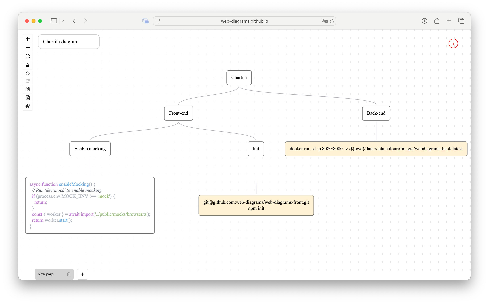

# Chartila

<div align="center">
  <h2>
    An open-source project for creating diagrams </br>
  </h2>
</div>

<div align="center">
  <figure>
    
  </figure>
</div>

## Features

- 📐 Node alignment (horizontal and vertical)
- 🎨 Node color highlighting
- 🖼️ Export to PNG
- 📂 Multi-Tab Document Support
- 💾 Two working modes:
  - **Local** – saves diagrams as files,
  - **Server** – stores diagrams via your backend
- 🌐 Web-based application – no installation needed
- 🔀 Cross-Tab/Cross-Browser Copy & Paste

## Quick start

**You can start using Chartila right away in two different modes:**

#### 1. Local mode (no setup required)

Use our hosted version on GitHub Pages:  
👉 [web-diagrams.github.io/web-diagrams-front](https://web-diagrams.github.io/web-diagrams-front/)

- No installation needed.
- Diagrams are saved as local `.json` files on your machine.
- Export to SVG/PNG supported.

#### 2. Server mode (optional backend)

To enable cloud storage and user accounts, you can run your own backend server using Docker:

```bash
docker run -d -p 8080:8080 -v $(pwd)/data:/data colourofmagic/webdiagrams-back:latest
```